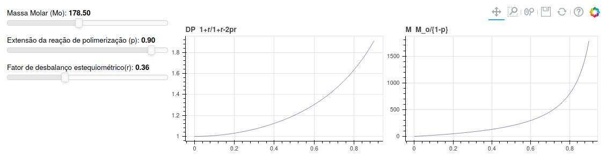

# Polycondensation

Polycondensation, also called step polymerization because of its synthesis mechanism,
is an important technique used to produce polymer materials like the polyamides (eg. nylon).
Many chemical reaction can be employed to proceed the condensation, such as esterification, amidation,
urethanes, etc. However the kinematics of those reactions still the same.

This simple app shows the mass distribution of the polymer and the degree of polymerization during the transformations on reactor, an important feature to control the  final material properties. The mathematical model is given by Carothers and Flory studies.

# Using Locally

Download this repository then execute:
> bokeh serve myapp/ --show

# Running online

You can access the app at :

[Polycondensation](http://polycondensation.herokuapp.com/myapp)
